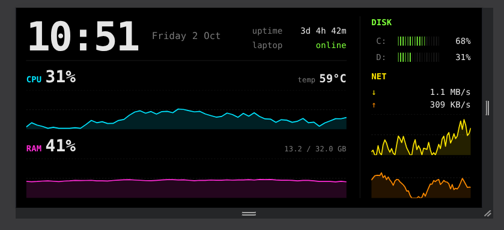

# Desk Dashboard

A live system-stats display for my laptop, running on an old **Redmi 9A** Android phone that sits on my desk.

The laptop runs a small Node.js server that reports its stats. The phone runs a static React build in kiosk mode and polls that server, so it works as an always-on second screen.

 

## What it shows

- CPU usage
- RAM usage
- Disk usage
- Temperature
- Uptime
- Network activity

The UI is deliberately minimal and terminal-style: dark background, muted green, JetBrains Mono, flat bars. No glow, no animations.

## How it works

```
 Laptop                               Android phone (Redmi 9A)
┌─────────────────────────┐           ┌──────────────────────────────┐
│ Express + systeminfo    │  <─ HTTP ─│ Termux: serve -s build       │
│ server (/server)        │   (LAN)   │ Fully Kiosk Browser (kiosk)  │
└─────────────────────────┘           │ React build (/Frontend)      │
                                      └──────────────────────────────┘
```

- **Server (`/server`):** Node.js + Express. Uses the [`systeminformation`](https://www.npmjs.com/package/systeminformation) package to read CPU, memory, disk, temperature, uptime and network stats and expose them as JSON.
- **Frontend (`/Frontend`):** React app that fetches the stats and renders them.
- **Phone:** the production build is served statically from **Termux** (`serve -s build`) and shown full-screen in **Fully Kiosk Browser**. **Termux:Boot** starts the server on boot, so the dashboard comes back by itself after a restart.

## Tech stack

React, Node.js, Express, systeminformation, Termux, Termux:Boot, Fully Kiosk Browser, SSH, rsync

## Setup

### 1. Laptop (stats server)

```bash
cd server
npm install
npm start
```

### 2. Frontend

```bash
cd Frontend
npm install
npm run build
```

Point the frontend at your laptop's local IP address so the phone can reach the server over the same network.

### 3. Phone (Termux)

```bash
pkg install nodejs openssh
npm install -g serve
cd Frontend
serve -s build
```

Then open the phone's address in Fully Kiosk Browser and enable kiosk mode. Put the start command in a script in `~/.termux/boot/` so Termux:Boot runs it on startup.

## Deploying updates

I manage the phone over **SSH** and push new builds with an **rsync** script, so I don't have to touch the device to update it:

```bash
npm run build
rsync -av --delete build/ <phone-user>@<phone-ip>:<path-to-build>/
```

(Termux's SSH server listens on port 8022 by default; add `-e "ssh -p 8022"` to the rsync command.)

## Why I built it

To give an old phone a second life and get hands-on with the operations side of a project: running a server, managing a remote device over SSH, auto-starting services with Termux:Boot, and scripting deploys with rsync.